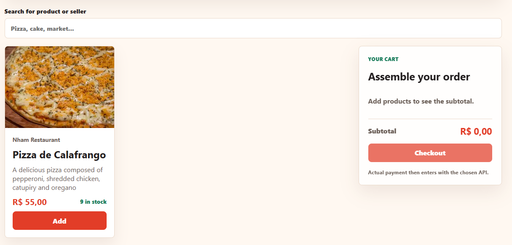

# Delivery Hub Frontend

Frontend application for **Delivery Hub**, built with **Next.js**, **React** and **TypeScript**.

The frontend provides a modern interface for customers to browse products and place orders, while sellers can manage their own products through an authenticated dashboard.

---

# Preview



---

# Overview

The frontend communicates with the FastAPI backend through REST APIs and provides different user experiences depending on the authenticated user's role.

Implemented interfaces include:

- Customer marketplace
- User authentication
- Seller dashboard
- Product management
- Order workflow

---

# Technologies

- Next.js
- React
- TypeScript
- App Router
- Fetch API

---

# Features

### Authentication

- User registration
- Login
- Logout
- JWT authentication

---

### Marketplace

- Browse products
- Product details
- Responsive product catalog

---

### Seller Dashboard

- Create products
- Update products
- Delete products
- Manage inventory

---

### Orders

- Customer checkout flow
- Order management
- Payment integration (coming soon)

---

# Application Structure

```
Frontend
│
├── app
├── components
├── hooks
├── services
├── types
├── public
└── README.md
```

---

# Design Decisions

The frontend was developed following a component-based architecture with a clear separation between presentation and API communication.

Main architectural decisions:

- Next.js App Router
- Reusable React components
- Service layer for API communication
- TypeScript for type safety
- Environment-based configuration
- JWT authentication flow

---

# Environment Variables

Create a `.env.local` file.

```env
NEXT_PUBLIC_API_URL=http://localhost:8000
```

---

# Running Locally

Install dependencies

```bash
npm install
```

Start the development server

```bash
npm run dev
```

The application will be available at

```
http://localhost:3000
```

---

# Backend

The frontend communicates with the Delivery Hub backend through the REST API.

Backend documentation:

**[Backend README](../Backend/README.md)**

---

# Deployment

| Service | Platform |
|----------|----------|
| Frontend | Vercel |
| Backend | Render |
| Database | Supabase |

---

# Related Documentation

Project overview:

**[Delivery Hub](../README.md)**

Backend documentation:

**[Backend README](../Backend/README.md)**

---

# License

MIT License