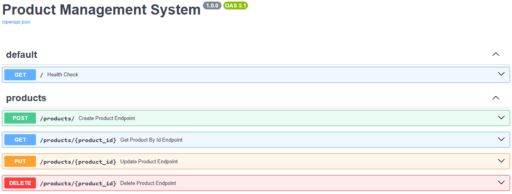

# Product Management System

This project is a full-stack system for managing products, built with a modern and scalable architecture.
It is designed to demonstrate best practices in backend development, API design, and project organization.

## Project Structure

- **backend/** – FastAPI application responsible for the API, business logic and database access  
- **frontend/** – Frontend application (current implementation)

### API Documentation Preview

## Technologies

- Python (FastAPI)
- PostgreSQL
- SQLAlchemy
- Alembic
- Poetry
- GitHub Actions (CI/CD)

## Getting Started

To run the project locally, follow the setup instructions inside the backend folder:

**[Backend Setup Guide](./backend/README.md)**

## Features

- Create, read, update and delete products
- List products with pagination
- Retrieve product details by ID
- Data validation and error handling

## Technical Highlights

- RESTful API built with FastAPI
- Clean architecture and separation of concerns
- Database migrations with Alembic
- Automated testing with Pytest
- Interactive API documentation with Swagger

## Project Status

This project is under active development.  
Future improvements include:
- Frontend interface
- Authentication and authorization (JWT)
- Role-based access control
- Caching and performance improvements
- Dockerization and container orchestration

## License

This project is licensed under the MIT License.